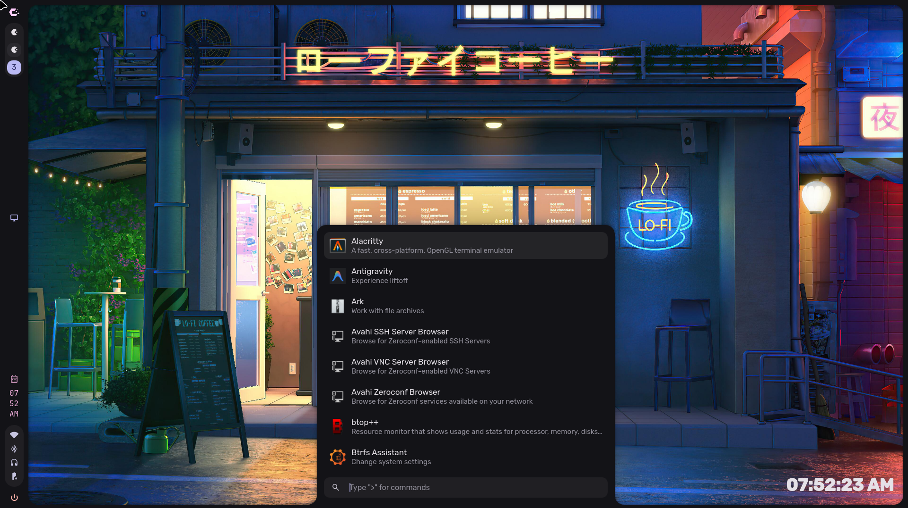
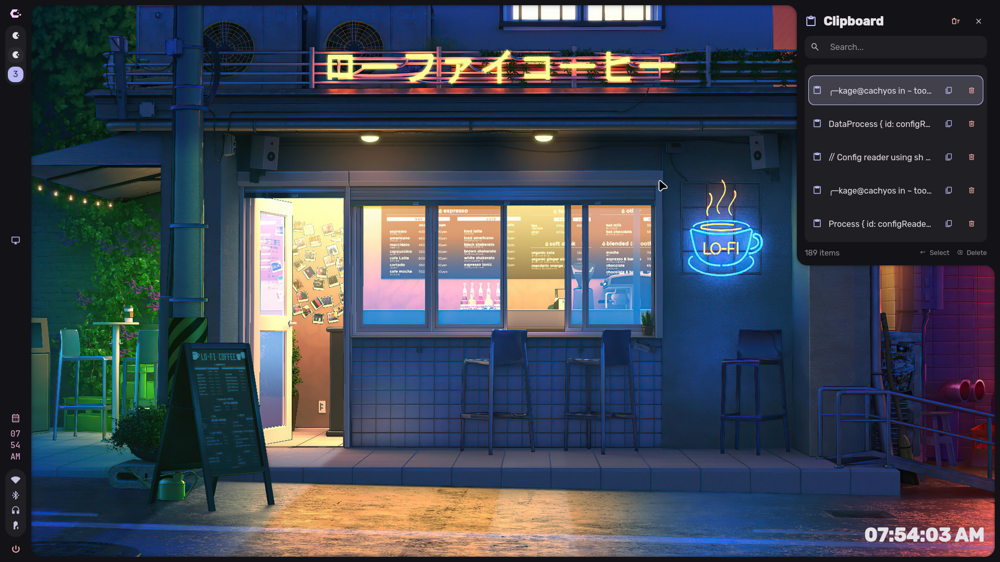
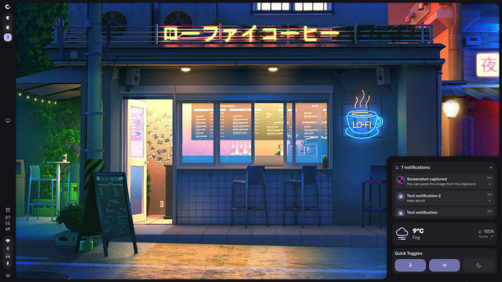
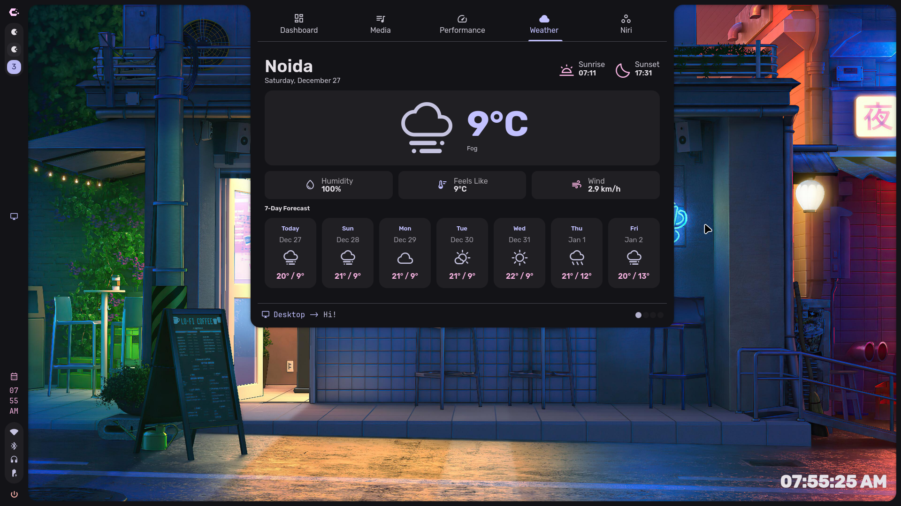
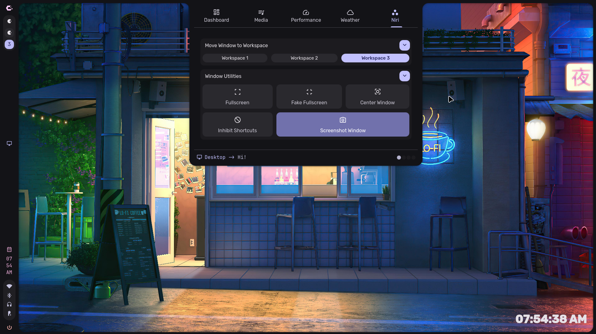
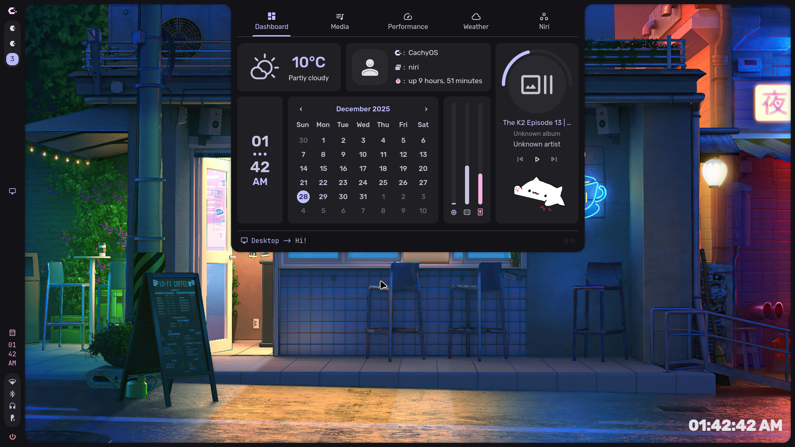

<h1 align=center>🌌 CuTShell-Niri</h1>

<div align=center>

*为 Niri 窗口管理器打造的 Quickshell 桌面环境*

</div>

<div align=center>

[](https://github.com/TurkeyC/CuTShell-Niri)
[](https://github.com/TurkeyC/CuTShell-Niri)

</div>

---

## 📜 分支谱系

```
caelestia-dots/shell                    ← Caelestia 原版（Hyprland）
  └─ jutraim/niri-caelestia-shell       ← 移植到 Niri 窗口管理器
       └─ AyushKr2003/niri-caelestia-shell  ← 增强功能、添加配置编辑器等
            └─ TurkeyC/CuTShell-Niri    ← 🎯 本仓库：深度定制与 Fedora 适配
```

本项目是 [AyushKr2003/niri-caelestia-shell](https://github.com/AyushKr2003/niri-caelestia-shell) 的个人深度定制分支，而上游依次继承自 [jutraim 的 Niri 移植版](https://github.com/jutraim/niri-caelestia-shell) 和 [Caelestia Shell 原版](https://github.com/caelestia-dots/shell)。

---

## ✨ 我的修改

基于 AyushKr2003/niri-caelestia-shell，我做了大量深度定制与修复：

### 🖥️ 窗口管理器集成
- **Niri IPC C++ 原生插件** — 用 C++ 编写 `NiriIpc` 原生插件，通过 `niri-ipc` socket 实现高效的双向通信，替代纯 QML 方案
- **Niri IPC 事件解析器** — 实时解析 Niri 事件流，支持 workspace、window、output、keyboard layout 等事件的推送更新
- **Niri 工作区分组** — 按应用名自动对窗口图标分组，整洁展示
- **工作区拖拽排序** — 支持拖拽窗口到不同工作区，带状态机管理逐步移动
- **工作区上下文菜单** — 右键菜单支持窗口聚焦、关闭、切换浮动、全屏等操作
- **Niri 仪表盘控制** — Dashboard 面板集成 Niri IPC 控制入口

### 🧩 新增组件
- **Task Manager（任务管理器）** — 实时 CPU/GPU/内存监视（AMD/NVIDIA，暂不支持 Intel）
- **WindowDecorations（窗口装饰）** — 窗口标题/装饰小部件
- **ActiveWindow 增强** — Firefox 标题清理、布局修复
- **Battery Monitor（电池监控）** — 可配置多级警告通知（带自定义图标和文字），临界值自动休眠
- **System Monitor（系统监视器）** — Dashboard 中的实时性能图表

### ⚙️ 配置与适配
- **配置路径变更** — 从 `~/.config/niri_caelestia/` 迁移至 `~/.config/quickshell/caelestia/`，统一管理
- **Fedora 43 适配** — 完整的 Fedora COPR 安装指南与依赖列表
- **中文文档** — 安装指南、已知问题、配置说明全部中文化

### 🔧 问题修复
- `OccupiedBg.qml` — 修复 `pills[-1]` 导致的 `TypeError: Value is undefined`
- `_env.sh` — 修复 jq `//` 运算符将 `false` 错误视为 falsy 值的问题
- 序列化修复 — `serializeAppearance()` 不再丢失 `wallpaperTheming` 段
- 多项 QML 组件健壮性改进

---

## 📸 截图

| 应用启动器 | 剪贴板 |
|:---:|:---:|
|  |  |

| 快捷开关 | 天气 |
|:---:|:---:|
|  |  |

| Niri 集成 | Dashboard |
|:---:|:--:|
|  |  |

---

## 📦 依赖

### 核心
- `quickshell` — 桌面 Shell 框架（Arch: `quickshell-git` AUR / Fedora: COPR）
- `networkmanager` + `networkmanager-qt` — 网络管理
- `qt6-declarative` — Qt6 QML 运行时
- `glibc`、`gcc-libs` — 系统库

### 音频与可视化
- `cava` + `libcava` — 音频频谱可视化
- `aubio` — 节拍检测
- `libpipewire` — PipeWire 音频管道
- `ddcutil` — 外接显示器 DDC/CI 亮度控制
- `brightnessctl` — 笔记本屏幕亮度控制

### 字体
- `ttf-material-icons-git` / `material-symbols-fonts` — Material 图标字体
- `ttf-jetbrains-mono` — 等宽字体

### 工具
- `grim` — Wayland 截图
- `swappy` — 截图编辑
- `libqalculate` — 计算器功能
- `tesseract` + `tesseract-data-eng` — OCR 文字识别
- `wl-clipboard` + `cliphist` — Wayland 剪贴板历史
- `app2unit` — 应用启动包装（见下方说明）
- `curl` — HTTP 请求（天气等）
- `python-materialyoucolor` / `matugen` — 壁纸动态取色

### 构建依赖
- `cmake`、`ninja` — 构建系统
- `qt6-qtbase-devel`、`qt6-qtdeclarative-devel` — Qt6 开发头文件
- `qt6-qtmultimedia-devel` — 多媒体支持
- `qt6-qtsvg-devel` — SVG 支持
- `pipewire-devel` — PipeWire 开发头文件
- `aubio-devel` — Aubio 开发头文件
- `libqalculate-devel` — Qalculate 开发头文件
- `gcc-c++` — C++ 编译器

### 关于 `app2unit`

`app2unit` 是 Quickshell 的应用启动包装工具。如果包管理器未提供，可手动创建：

```bash
sudo tee /usr/local/bin/app2unit << 'SCRIPT'
#!/bin/bash
exec systemd-run --user --scope --collect "$@"
SCRIPT
sudo chmod +x /usr/local/bin/app2unit
```

> [!NOTE]
> 与 Caelestia 原版不同，[`caelestia-cli`](https://github.com/caelestia-dots/cli) **不是本项目的运行时依赖**。

---

## ⚡ 安装

### 前置条件

确保已安装 Niri 窗口管理器，并已配置好 `~/.config/niri/config.kdl`。

### 1. 克隆仓库

```bash
mkdir -p ~/.config/quickshell
cd ~/.config/quickshell
git clone https://github.com/TurkeyC/CuTShell-Niri caelestia
```

### 2. 安装依赖

**Arch Linux：**
```bash
sudo pacman -S cmake ninja qt6-declarative qt6-qtmultimedia qt6-qtsvg \
  glibc gcc-libs networkmanager networkmanager-qt pipewire aubio \
  libqalculate grim swappy tesseract tesseract-data-eng wl-clipboard \
  curl ddcutil brightnessctl fish glibc
# AUR
yay -S quickshell-git ttf-material-icons-git ttf-jetbrains-mono cliphist cava
pip install materialyoucolor
```

**Fedora 43+：**
```bash
# 先通过 COPR 安装 quickshell
sudo dnf install material-symbols-fonts matugen cliphist wl-clipboard grim \
  tesseract brightnessctl ddcutil libnotify NetworkManager xdg-utils cava \
  papirus-icon-theme fish
sudo dnf install cmake gcc-c++ qt6-qtbase-devel qt6-qtdeclarative-devel \
  qt6-qtmultimedia-devel qt6-qtsvg-devel pipewire-devel aubio-devel \
  libqalculate-devel
```

### 3. 构建与安装

```bash
cd ~/.config/quickshell/caelestia

# 配置
cmake -S . -B build -G Ninja -DCMAKE_BUILD_TYPE=Release

# 编译
cmake --build build -j$(nproc)

# 安装（Arch Linux）
sudo cmake --install build --prefix /

# 安装（Fedora — 注意 QML 路径不同！）
cmake -S . -B build -DCMAKE_BUILD_TYPE=Release -DINSTALL_QMLDIR="usr/lib64/qt6/qml"
sudo cmake --install build --prefix /
```

> [!IMPORTANT]
> Fedora 的 Qt6 QML 路径是 `/usr/lib64/qt6/qml/`，而不是 `/usr/lib/qt6/qml/`。不指定正确的路径会导致 QML 引擎加载到系统自带的旧版 Caelestia 插件，缺少 `CachingImageManager` 等自定义类型。

### 4. 运行 setup 脚本

```bash
./scripts/setup/setup.sh
```

支持参数：`--skip-deps`、`--skip-python`、`--skip-services`

### 5. 部署 dotfiles（可选）

```bash
cp -r dotfiles/.config/* ~/.config/
```

> 复制 `matugen` 文件夹到 `~/.config/` 是壁纸动态取色功能的**必要条件**。

### 6. 启动 Shell

```bash
quickshell --config caelestia
```

在 Niri 配置中设置为自启动：

```kdl
spawn-at-startup "quickshell" "-c" "caelestia" "-n"
```

---

## 🚀 使用方法

### IPC 快捷键

所有 IPC 命令通过 `quickshell -c caelestia ipc call ...` 调用。

示例 — 在 Niri `config.kdl` 中绑定：

```kdl
// 应用启动器
Mod+Space { spawn-sh "qs -c caelestia ipc call drawers toggle launcher"; }

// 剪贴板历史
Mod+V { spawn-sh "qs -c caelestia ipc call clipboard open"; }

// 锁屏
Mod+L { spawn-sh "qs -c caelestia ipc call lock lock"; }

// 区域截图
Mod+Shift+S { spawn-sh "qs -c caelestia ipc call picker open"; }

// OCR 文字识别
Mod+Shift+X { spawn-sh "qs -c caelestia ipc call picker regionOcr"; }

// Google Lens 图像搜索
Mod+Shift+A { spawn-sh "qs -c caelestia ipc call picker regionSearch"; }

// 电源菜单
Ctrl+Alt+Delete { spawn-sh "qs -c caelestia ipc call drawers toggle session"; }
```

### 可用 IPC 命令

通过 `qs -c caelestia ipc show` 查看完整列表，主要包括：

| 目标 | 功能 |
|------|------|
| `drawers` | 切换/列出各抽屉面板（launcher、session、dashboard 等） |
| `picker` | 区域截图、OCR、Google Lens 搜索 |
| `lock` | 锁屏/解锁 |
| `clipboard` | 打开/切换/关闭剪贴板历史 |
| `quicktoggles` | 打开/切换/关闭快捷开关面板 |
| `controlCenter` | 打开控制中心 |
| `mpris` | 媒体播放控制（播放/暂停/下一首/上一首） |
| `notifs` | 清除通知 |
| `brightness` | 获取/设置亮度 |
| `wallpaper` | 获取/设置/列出壁纸 |
| `toaster` | 发送 toast 通知（info/success/warn/error） |
| `idleInhibitor` | 切换/启用/禁用空闲抑制 |

---

## ⚙️ 配置

配置文件位于：

```
~/.config/quickshell/caelestia/shell.json
```

主要配置段：

| 段 | 说明 |
|-----|------|
| `appearance` | 字体、动画、透明度、间距、圆角、内边距 |
| `general` | 应用（终端、文件管理器、音频等）、电池警告、空闲超时 |
| `background` | 壁纸、桌面时钟、音频可视化 |
| `bar` | 顶部栏条目顺序、工作区、托盘、状态图标、弹出窗口 |
| `border` | 窗口边框圆角/厚度 |
| `dashboard` | 信息面板布局、性能图表 |
| `launcher` | 启动器模式、模糊搜索、壁纸预览 |
| `lock` | 锁屏指纹、尺寸、额外信息 |
| `notifs` | 通知过期、展开、清除阈值 |
| `osd` | 亮度/音量/麦克风 OSD |
| `services` | 天气位置、音频增量、播放器别名、GPU 类型 |
| `session` | 电源命令、Vim 快捷键 |
| `utilities` | Toast 通知、VPN |

详细示例配置见 [shell.json 示例](#)。

---

## 🎨 主题

本 shell 支持 Material You 动态取色主题。详细设置指南见 [THEME.md](THEME.md)。

### 头像设置

仪表盘头像读取自 `~/.face`，可通过将此文件指向你的头像图片来设置。

### 壁纸切换

壁纸目录默认为 `~/Pictures/Wallpapers`，可在配置中修改。在启动器中使用 `> wallpaper` 命令切换壁纸。

---

## 🧪 已知问题

1. **Task Manager** 暂不支持 Intel GPU（仅 AMD/NVIDIA）
2. **Dashboard** 下拉后在左右空白区域点击有时无法收起
3. **QuickToggles → 设置** 无法正常跳转 ControlCenter
4. 部分配置段存在冗余和混乱，后续会清理
5. **Novel/Manga 阅读器后端** 需要额外编译 `extras/` 目录下的服务端（不影响核心功能）
6. Quickshell 偶发崩溃（上游问题，会自动重启）

详细问题列表见 [部分还存在的一些问题.md](部分还存在的一些问题.md)。

---

## 📁 项目结构

```
~/.config/quickshell/caelestia/
├── shell.qml                    # 入口文件
├── shell.json                   # 配置文件
├── config/                      # 配置 QML 组件
├── modules/                     # 核心模块
│   ├── bar/                     # 顶部状态栏
│   ├── launcher/                # 应用启动器
│   ├── dashboard/               # 信息面板
│   ├── controlcenter/           # 控制中心
│   ├── lock/                    # 锁屏
│   ├── notifications/           # 通知
│   ├── osd/                     # 音量/亮度 OSD
│   ├── session/                 # 电源菜单
│   ├── quicktoggles/            # 快捷开关
│   ├── areapicker/              # 区域选择（截图/OCR）
│   └── background/              # 壁纸与背景
├── services/                    # 后台服务（Niri IPC、音频、网络等）
├── components/                  # UI 组件库
├── plugin/src/Caelestia/        # C++ 原生 QML 插件
├── scripts/                     # 辅助脚本
├── dotfiles/                    # 可部署的配置文件
├── images/                      # 截图
└── assets/                      # 资源文件（logo、gif、emoji 等）
```

---

## 🙏 鸣谢

- [Quickshell](https://github.com/outfoxxed/quickshell) — 核心 Shell 框架
- [Caelestia Shell](https://github.com/caelestia-dots/shell) — 原版项目
- [jutraim/niri-caelestia-shell](https://github.com/jutraim/niri-caelestia-shell) — Niri 移植版
- [AyushKr2003/niri-caelestia-shell](https://github.com/AyushKr2003/niri-caelestia-shell) — 上游分支
- [end-4/dots-hyprland](https://github.com/end-4/dots-hyprland) — 功能与设计灵感
- [Niri](https://github.com/YaLTeR/niri) — 窗口管理器

---

## 📄 许可

GNU General Public License v3.0 — 详见 [LICENSE](LICENSE)。